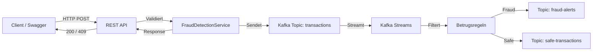
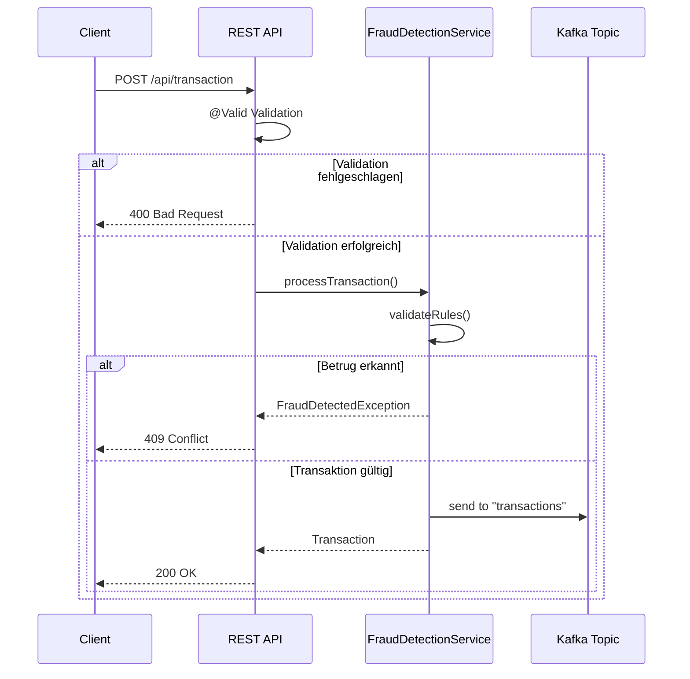
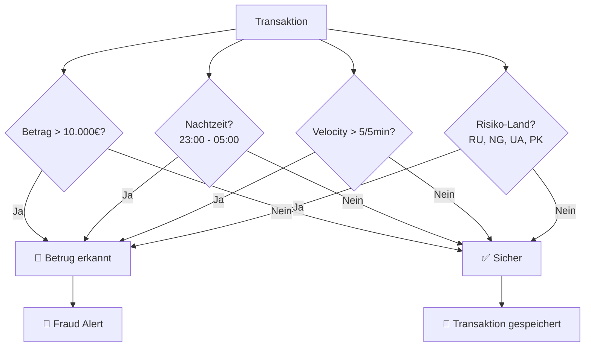

# 🛡️ Fraud Detection System

> Echtzeit-Betrugserkennung mit Spring Boot, Apache Kafka und Java 21


---

## 📋 Überblick

**Problem:** Manuelle Betrugsprüfung ist langsam, teuer und fehleranfällig. Finanzinstitute verlieren Milliarden durch Betrug.

**Lösung:** Automatisierte Echtzeit-Betrugserkennung mit Kafka Streams und vordefinierten Regeln.

### 🎯 Key Features
- ⚡ **Echtzeit-Verarbeitung** mit Kafka Streams
- 🧠 **4 Betrugsregeln** (Betrag, Nachtzeit, Velocity, Risiko-Länder)
- 📊 **REST API** mit Swagger UI Dokumentation
- 🛡️ **Validation** & **Global Exception Handling**
- 🐳 **Docker** für einfache Kafka-Installation
- 🧹 **Clean Code** nach SOLID Prinzipien

### 📊 Tech Stack

| Technologie | Version | Zweck |
|------------|---------|-------|
| Java | 21 | Programmiersprache |
| Spring Boot | 3.4.1 | Application Framework |
| Apache Kafka | 4.3.0 | Event Streaming |
| Kafka Streams | - | Echtzeit-Verarbeitung |
| Swagger/OpenAPI | 2.5.0 | API Dokumentation |
| Docker | - | Containerisierung |
| Maven | - | Build Tool |

---

## 📁 Projektstruktur
```text
fraud-detection/
├── src/main/java/com/robtech/fraud_detection/
│   ├── config/          # Kafka Konfiguration
│   ├── controller/      # REST Controller
│   ├── dto/             # Data Transfer Objects
│   ├── events/          # Transaction Record
│   ├── exception/       # Exception Handling
│   ├── service/         # Business Logic
│   └── streams/         # Kafka Streams Processing
├── src/main/resources/
│   └── application.properties
└── pom.xml
```


## 🏗️ Architektur & Systemdesign

### Systemarchitektur
Die Anwendung folgt einer **Event-Driven Architecture (EDA)**. Sie nutzt Kafka Streams, um eingehende Transaktionen ohne nennenswerte Latenz zu bewerten und basierend auf Mustern als sicher oder betrügerisch einzustufen.

### 1. Datenflussdiagramm
Dieses Diagramm zeigt den Weg einer Transaktion vom Client über die REST-Schnittstelle bis hin zu den spezialisierten Kafka-Topics nach der Regelprüfung.



### 2. Sequenzdiagramm (API-Validierung)
Hier siehst du die synchrone HTTP-Abwicklung und wie das System reagiert, wenn die Validierung fehlschlägt oder ein direkter Betrugsverdacht vorliegt.



### 3. Logikdiagramm (Betrugsregeln)
Das System wendet vier parallele Kriterien an, um das Risiko einer Transaktion einzustufen.



### Übersicht der Regelspezifikationen

| # | Regel | Beschreibung | Schwelle / Kriterium |
|---|---|---|---|
| 1 | **Betrag** | Transaktion über Limit | > 10.000 € |
| 2 | **Nachtzeit** | Transaktion zu unüblichen Zeiten | 23:00 - 05:00 Uhr |
| 3 | **Velocity** | Zu viele Transaktionen in kurzer Zeit | > 5 Transaktionen in 5 Min. |
| 4 | **Risiko-Länder** | Herkunftsland auf der Blacklist | RU, NG, UA, PK |


## ⚙️ Installation & Konfiguration

### Systemvoraussetzungen
Stelle sicher, dass die folgenden Tools auf deinem System installiert sind:
- **Java 21** oder höher
- **Maven 3.9+**
- **Docker & Docker Compose**

### 1. Infrastruktur starten (Apache Kafka)
Erstelle eine `docker-compose.yml` im Projektwurzelverzeichnis, um Kafka und Zookeeper lokal via Docker zu starten:

```yaml
version: '3.8'

services:
  zookeeper:
    image: confluentinc/cp-zookeeper:7.5.0
    container_name: fraud-zookeeper
    environment:
      ZOOKEEPER_CLIENT_PORT: 2181
      ZOOKEEPER_TICK_TIME: 2000

  kafka:
    image: confluentinc/cp-kafka:7.5.0
    container_name: fraud-kafka
    depends_on:
      - zookeeper
    ports:
      - "9092:9092"
    environment:
      KAFKA_BROKER_ID: 1
      KAFKA_ZOOKEEPER_CONNECT: zookeeper:2181
      KAFKA_ADVERTISED_LISTENERS: PLAINTEXT://localhost:9092,PLAINTEXT_INTERNAL://kafka:29092
      KAFKA_LISTENER_SECURITY_PROTOCOL_MAP: PLAINTEXT:PLAINTEXT,PLAINTEXT_INTERNAL:PLAINTEXT
      KAFKA_OFFSETS_TOPIC_REPLICATION_FACTOR: 1
```

Führe danach folgenden Befehl im Terminal aus, um die Container im Hintergrund zu starten:
```bash
docker-compose up -d
```

### 2. Anwendung konfigurieren
Erstelle oder bearbeite die Datei `src/main/resources/application.properties`, um die Spring-Boot-Anwendung mit dem Kafka-Broker zu verbinden:

```properties
# Server Konfiguration
server.port=8080

# Spring Application Name
spring.application.name=fraud-detection-system

# Apache Kafka Konfiguration
spring.kafka.bootstrap-servers=localhost:9092
spring.kafka.consumer.group-id=fraud-detection-group
spring.kafka.consumer.auto-offset-reset=earliest

# Kafka Streams Konfiguration
spring.kafka.streams.application-id=fraud-streams-app
spring.kafka.streams.bootstrap-servers=localhost:9092

# Topic Definitionen
app.kafka.topics.transactions=transactions
app.kafka.topics.fraud-alerts=fraud-alerts
app.kafka.topics.safe-transactions=safe-transactions

# OpenAPI / Swagger Dokumentation
springdoc.api-docs.path=/api-docs
springdoc.swagger-ui.path=/swagger-ui.html
```

### 3. Projekt bauen & starten
Kompiliere das Projekt und starte die Spring-Boot-Anwendung mit Maven:

```bash
# Abhängigkeiten auflösen und bauen
mvn clean package -DskipTests

# Anwendung starten
mvn spring-boot:run
```


## 🚀 Nutzung & API-Referenz

Sobald die Anwendung läuft, ist die interaktive API-Dokumentation über **Swagger UI** erreichbar:
👉 `http://localhost:8080/swagger-ui.html`

### 1. API-Endpunkte

#### 📥 Transaktion einreichen
- **Endpoint:** `POST /api/transactions`
- **Content-Type:** `application/json`

##### Beispiel A: Validere Payload (Erfolgreich)
```json
{
  "transactionId": "tx-99231-abc",
  "userId": "user-8812",
  "amount": 250.00,
  "currency": "EUR",
  "countryCode": "DE",
  "timestamp": "2026-06-24T14:30:00Z"
}
```
- **Response:** `200 OK` (Transaktion wird an das Kafka-Topic weitergeleitet)

##### Beispiel B: Regelverletzung "Betrag" (Abgelehnt)
```json
{
  "transactionId": "tx-99232-abc",
  "userId": "user-8812",
  "amount": 15000.00,
  "currency": "EUR",
  "countryCode": "DE",
  "timestamp": "2026-06-24T14:32:00Z"
}
```
- **Response:** `409 Conflict` (FraudDetectedException: Betrag überschreitet Limit)

##### Beispiel C: Regelverletzung "Risiko-Land" (Abgelehnt)
```json
{
  "transactionId": "tx-99233-abc",
  "userId": "user-4412",
  "amount": 50.00,
  "currency": "EUR",
  "countryCode": "RU",
  "timestamp": "2026-06-24T14:35:00Z"
}
```
- **Response:** `409 Conflict` (FraudDetectedException: Herkunftsland blockiert)

---

### 2. Kafka Topics überwachen (CLI)

Um zu sehen, wie die Kafka-Streams-Komponente die Daten in Echtzeit verarbeitet und aufteilt, kannst du die integrierten Kafka-Tools im Docker-Container nutzen.

Öffne ein separates Terminal und starte die Consumer:

```bash
# Eingehende Transaktionen live ansehen
docker exec -it fraud-kafka kafka-console-consumer --bootstrap-server localhost:9092 --topic transactions --from-beginning

# Ausschließlich Betrugswarnungen (Fraud Alerts) abfangen
docker exec -it fraud-kafka kafka-console-consumer --bootstrap-server localhost:9092 --topic fraud-alerts --from-beginning

# Ausschließlich sichere Transaktionen abfangen
docker exec -it fraud-kafka kafka-console-consumer --bootstrap-server localhost:9092 --topic safe-transactions --from-beginning
```

## 🤝 Contribution & Lizenz

### 1. Tests ausführen
Das Projekt enthält Unit- und Integrationstests für die REST-Controller sowie für die Kafka-Streams-Topologie. Du kannst die Testsuite mit folgendem Maven-Befehl starten:

```bash
mvn test
```

### 2. Contribution Guidelines
Beiträge zur Erweiterung des Fraud-Detection-Systems sind jederzeit willkommen! Wenn du neue Betrugsregeln (z.B. Machine-Learning-Modelle) hinzufügen möchtest, folge bitte diesen Schritten:

1. **Forke** das Repository.
2. Erstelle einen neuen Feature-Branch (`git checkout -b feature/neue-betrugsregel`).
3. Implementiere deine Änderungen nach SOLID-Prinzipien.
4. Stelle sicher, dass alle Tests grün sind.
5. Committe deine Änderungen (`git commit -m 'Add new velocity rule'`).
6. Pushe den Branch (`git push origin feature/neue-betrugsregel`).
7. Erstelle einen **Pull Request**.

### 3. Lizenz
Dieses Projekt ist unter der **MIT-Lizenz** lizenziert. Siehe die [LICENSE](LICENSE) Datei für Details.

### 4. Kontakt & Autoren
- **Entwickler:** RobTech / com.robtech
- **Projekt-Link:** [https://github.com](https://github.com)


